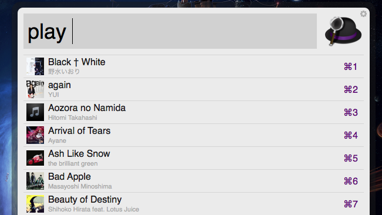
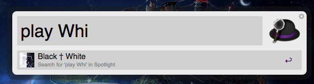
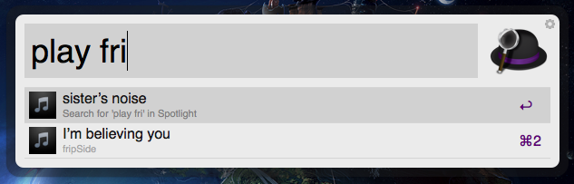

Maestro
====================

This is an [Alfred workflow](http://alfredapp.com) which allows you to control your current iTunes playlist.

This workflow is based on [alfred.py](https://github.com/Kasoki/alfred.py)

## Play content from your current playlist

## Filter by title or author

Licence
--------

This workflow is licenced under the terms of the [MIT Licence](http://opensource.org/licenses/MIT)